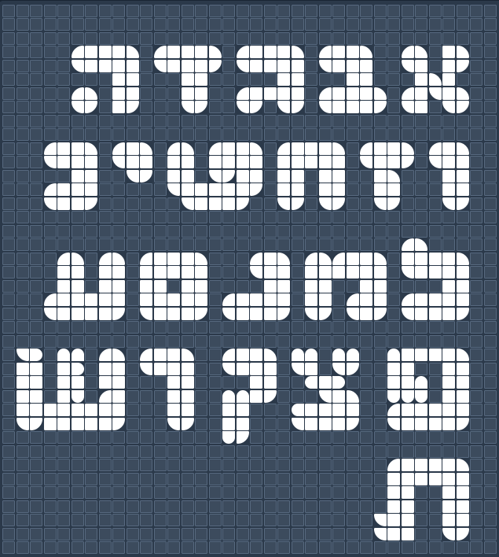

# BRICKZ Simulator



A modern, web-based LEGO DOTS-style brick simulator that lets you create pixel art designs with customizable colored bricks and shapes.

## 🎨 Features

- **50+ Grid Canvas** - Create designs on a customizable grid (10-100 width, 8-90 height)
- **10 Brick Shapes** - Full square, circle, and 8 rounded corner variations
- **Custom Color Palette** - Add unlimited custom colors with built-in color picker
- **Shadow Effects** - Add drop shadows to create depth in your designs
- **Tool Modes** - Place and Erase modes with keyboard shortcuts
- **Import/Export** - Save and load your designs as JSON files
- **Dark Mode** - Toggle between light and dark themes
- **Responsive Design** - Works on desktop, tablet, and mobile devices

## 🚀 Live Demo

Visit: [ajerbi.com/brickz](https://ajerbi.com/brickz)

## 🎮 How to Use

### Basic Controls
- **Click** to place bricks
- **Right-click** to remove bricks
- **Select shapes** from the toolbar (1-9, 0 keyboard shortcuts)
- **Choose colors** from the palette or add custom colors
- **Place/Erase** modes for different editing styles

### Keyboard Shortcuts
- `1-9, 0` - Select brick shapes
- `P` - Place mode
- `E` - Erase mode
- `C` - Clear canvas (with confirmation)
- `D` - Toggle dark mode

### Shadow Feature
1. Create your design with colored bricks
2. Click "👻 Add Shadows" to add drop shadows
3. Use "Shadow Color" to customize shadow color
4. Shadows appear on bottom-left of placed bricks for depth effect

### Save & Load
- **Export** - Download your design as JSON
- **Import** - Load previously saved designs
- Your custom colors are automatically saved in browser

## 🛠️ Technologies

- **HTML5/CSS3** - Modern web standards
- **JavaScript (Vanilla)** - No frameworks, pure JS
- **Tailwind CSS** - Utility-first styling
- **LocalStorage** - Persistent color and theme preferences

## 📦 Installation

1. Clone the repository:
```bash
git clone https://github.com/amosjerbi/portfolio.git
cd portfolio/brickz
```

2. Open `index.html` in your browser, or serve with any static server:
```bash
# Python
python -m http.server 8000

# Node.js
npx serve

# PHP
php -S localhost:8000
```

3. Visit `http://localhost:8000`

## 🎨 Use Cases

- **Pixel Art Creation** - Design logos, letters, and graphics
- **Hebrew Typography** - Create Hebrew text designs with brick shapes
- **LEGO Planning** - Plan real LEGO DOTS projects before building
- **Educational Tool** - Teach geometry, patterns, and design
- **Creative Expression** - Free-form artistic creation

## 📸 Screenshots

### Light Mode
Create colorful designs with the intuitive interface in light mode.

### Dark Mode
Switch to dark mode for comfortable late-night designing.

### Custom Colors
Add any color you want with the built-in color picker.

## 🤝 Contributing

Contributions are welcome! Feel free to:
- Report bugs
- Suggest features
- Submit pull requests

## 📄 License

MIT License - feel free to use this project for personal or commercial purposes.

## 👤 Author

**Amos Jerbi**
- Website: [ajerbi.com](https://ajerbi.com)
- GitHub: [@amosjerbi](https://github.com/amosjerbi)

## 🌟 Acknowledgments

Inspired by LEGO DOTS and pixel art creation tools.

---

Made with ❤️ and bricks

